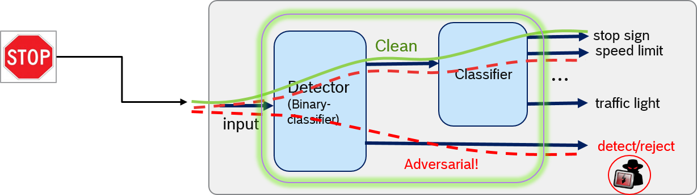
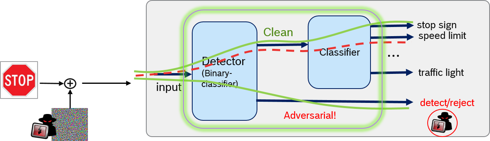

# Provably robust classification of adversarial examples with detection 
-------------------

This repository contains the code and models necessary to replicate the results of our recent paper: 

**Provably robust classification of adversarial examples with detection**, Fatemeh Sheikholeslami, Ali Lotfi Rezaabad, Zico Kolter (https://openreview.net/pdf?id=sRA5rLNpmQc), ICLR 2021

In this work, we jointly train a classification-detection model, which enables additional robustness capability by adaptively flagging adversarial inputs in order to prevent misclassification.


In a system enhanced with such detection capability, the **natural** images must be classified as clean by the detector, and correctly classified in the output class. 


<p>

</p>


An **adversarial** image on the other hand, can be  (a) flagged as adversarial - hence rejected- , **or** (b) correctly classified if marked as clean by the detector. 


<p>

</p>


By leveraging inteval bound propagation techniques, we train a provably robust augmented classifier with a dedicated detection class, and test on benchmark datasets, demonestrating the effectiveness of the enhanced capability in better performance trade-off between natural versus **verified** robust accuracy. 


Our code is based on the open source code of Zhang et al. available at https://github.com/huanzhang12/CROWN-IBP 


## Setup

This code has been tested with python 3.8.5 and PyTorch 1.6.0.


Trainnig parameters are setup through the JSON files which can be found under the config folder. 


## Run 


In order to train a joint classifier-detector for cifar dataset with epsilon=8/255, run the following:

```python train.py "training_params:method=robust_natural" "training_params:method_params:bound_type=interval" --config config/cifar_dm-large_8_255.json```


The joint classifiecation-detection is only tested for Interval Bound Propagation (IBP) method, and other propagation techniques (including CROWN-IBP) are not tested. Thus, the code will not produce results for any **bound_type** parameter other than **interl**, that is:
```"training_params:method_params:bound_type=interval"```


Other config files to reproduce the results in the paper can be found in the config folder.


# License


The code in this repository is open-sourced under the AGPL-3.0 license. See the LICENSE file for details. For a list of other open source components included in this project, see the file 3rd-party-licenses.txt.


-------------------

## References

Sven Gowal, Krishnamurthy Dvijotham, Robert Stanforth, Rudy Bunel, Chongli Qin,
Jonathan Uesato, Timothy Mann, and Pushmeet Kohli. "On the effectiveness of
interval bound propagation for training verifiably robust models." arXiv
preprint arXiv:1810.12715 (2018).

Eric Wong, and J. Zico Kolter. Provable defenses against adversarial examples
via the convex outer adversarial polytope. ICML 2018.

Aleksander Madry, Aleksandar Makelov, Ludwig Schmidt, Dimitris Tsipras, and
Adrian Vladu. "Towards deep learning models resistant to adversarial attacks."
In International Conference on Learning Representations, 2018.

Huan Zhang, Tsui-Wei Weng, Pin-Yu Chen, Cho-Jui Hsieh, and Luca Daniel.
Efficient neural network robustness certification with general activation
functions. In Advances in neural information processing systems (NIPS), pp.
4939-4948. 2018.

Hadi Salman, Greg Yang, Huan Zhang, Cho-Jui Hsieh and Pengchuan Zhang. A Convex
Relaxation Barrier to Tight Robustness Verification of Neural Networks. To
appear in NeurIPS 2019.

